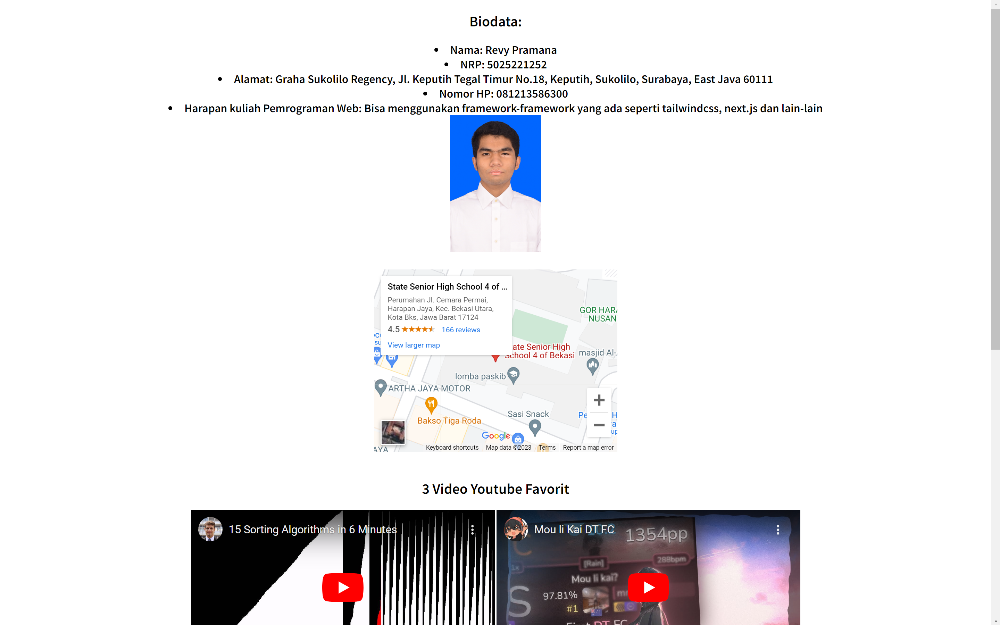
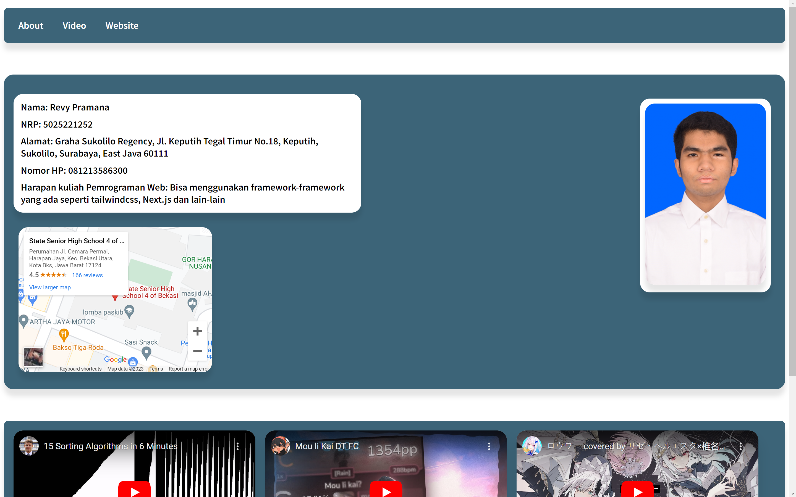
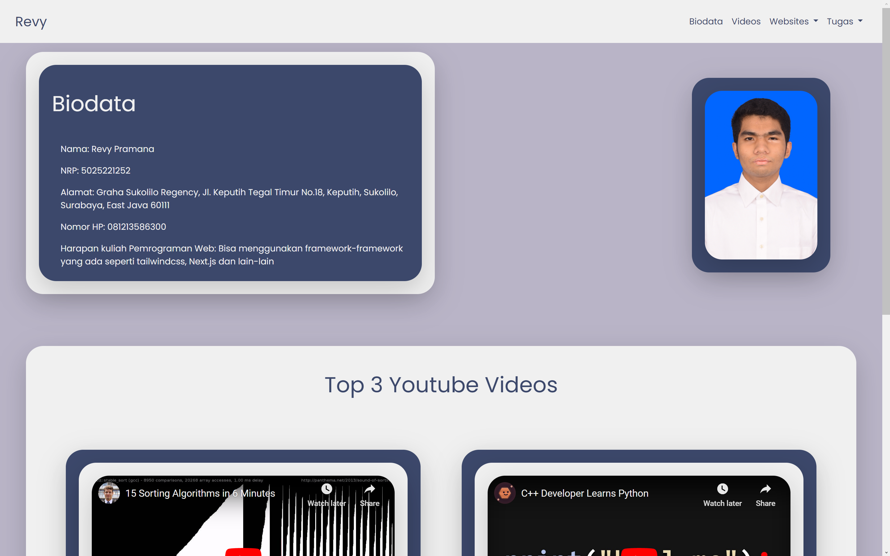

# Pweb-C
---
### Tugas 1:

Created a simple website with HTML & CSS as an introduction to the Website
 
 

---
### Tugas 2:

Improve the style/appearance of task 1 with improved CSS
 
 

---
### Tugas 3:

Improve website style/appearance using CSS framework (Bootstrap)

### Tugas 4:

Simple Php Script to Add, Modify, Delete and Display Data from MySQl

### Tugas 5:

Using databases for articles -> Modified ETS project
